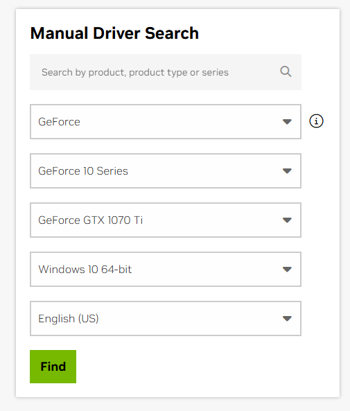
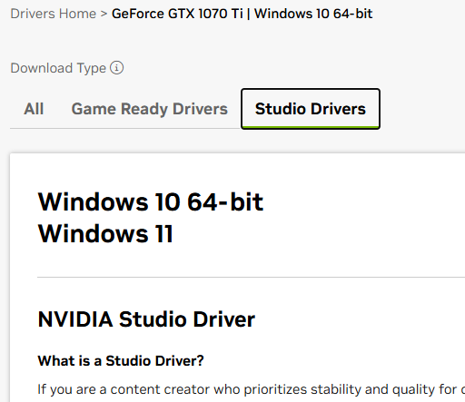
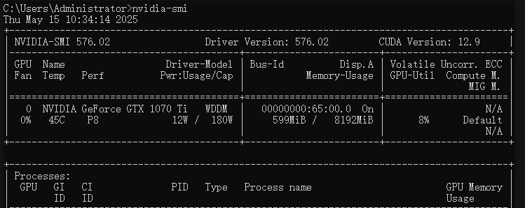
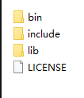
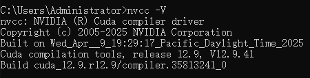

# cuda环境安装教程(for win)
# CUDA-Environment
CUDA Environment Files


### 第一步: 安装 NVIDIA Studio 显卡驱动:

    
NVIDIA Studio 官方驱动 下载地址:

https://www.nvidia.com/en-us/drivers/


### 这里选择对应的显卡型号和系统

### 选择Studio Drivers 驱动下载和安装

### 2:查看显卡的驱动信息 

打开CMD执行:
```cmd
nvidia-smi  
```



可以看到为 CUDA Version: 12.9 ,表示当前显卡支持的cuda版本


第二步: 安装cuda环境:
--------------
### 1:下载cuda 
cuda 官方下载地址 :

https://developer.nvidia.com/cuda-downloads

选择对应的cuda版本下载,这里要选择你显卡支持的版本

### 2:把下载的文件解压出来

得到3个目录 bin, include, lib



把这3个目录复制到cuda的安装目录

比如: C:\Program Files\NVIDIA GPU Computing Toolkit\CUDA\v12.9

### 3:最后测试CUDA是否配置成功

打开CMD执行:
```CMD
nvcc -V
```


### 安装成功


